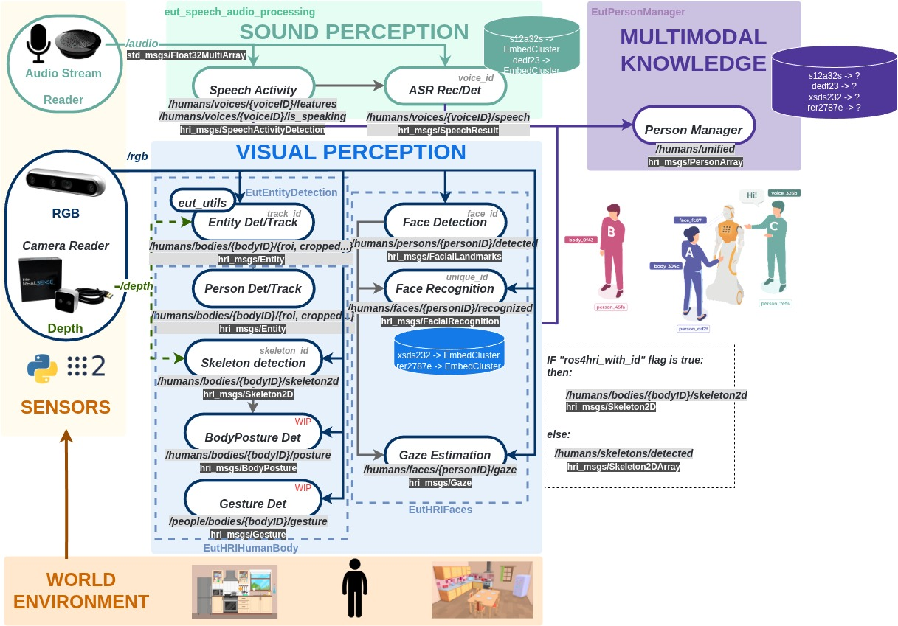

# EutRobAI Docker Base Images

[](https://github.com/Eurecat/EutRobAIDockers/actions/workflows/docker-build.yml?query=branch%3Ajazzy)

**Standard ROS 2:**
[](https://github.com/Eurecat/EutRobAIDockers/actions/workflows/docker-build.yml)
[](https://github.com/Eurecat/EutRobAIDockers/actions/workflows/docker-build.yml)

**Vulcanexus:**
[](https://github.com/Eurecat/EutRobAIDockers/actions/workflows/docker-build.yml)
[](https://github.com/Eurecat/EutRobAIDockers/actions/workflows/docker-build.yml)

## What This Repository Does

**EutRobAIDockers** provides the foundational Docker base images for the entire EutPerceptionStack. It serves as the common container base for all perception modules, ensuring consistent development and deployment environments across the stack. All other repositories (EutHRIFaces, EutEntityDetection, EutHRIHumanBody, EutPersonManager, eut_speech_audio_processing) build their containers on top of these base images.

<p align="center">
  
</p>

## Key Characteristics

- 🐳 **Foundation for EutPerceptionStack**: All perception modules build from these base images
- 🎛️ **Dual ROS2 Distributions**: Support for both standard ROS2 Jazzy and Vulcanexus Jazzy
- 🔥 **PyTorch Integration**: Pre-configured deep learning environment with GPU support
- 🔧 **Configurable Build**: Single Dockerfile with build arguments for different configurations
- 🧪 **Reference Implementations**: Template C++ and Python packages for testing and development
- 🚀 **Production Ready**: CI/CD pipelines with automated testing and coverage reporting
- 📦 **Minimal & Reproducible**: Optimized for consistency and portability

This repository provides a **configurable Docker base image** for robotics and AI development, offering minimal and reproducible Docker setup with **PyTorch** support and choice between different ROS 2 distributions.

The purpose is to serve as a **flexible base container** for robotics and AI projects, ensuring consistency and portability across environments while allowing teams to choose between standard ROS 2 or Vulcanexus distributions.

---

## 📦 Configurable Base Image Options

### **Standard ROS 2 Jazzy + PyTorch** (Default)
- Standard **ROS 2 Jazzy Desktop Full** distribution  
- **PyTorch** for deep learning models
- General-purpose robotics development with AI capabilities

### **ROS 2 Vulcanexus (Jazzy) + PyTorch** (with `--vulcanexus` flag)
- **ROS 2 Vulcanexus (Jazzy)** as the robotics middleware
- **PyTorch** for deep learning models  
- Optimized for multimodal perception pipelines:
  - **Sound perception** (VAD, ASR)
  - **Visual perception** (entity/person detection, skeletons, posture, gestures, faces, gaze)
  - **Multimodal knowledge integration** (person manager, identity tracking)

## 🏗️ EutPerceptionStack Architecture

This base image serves as the foundation for the complete perception stack:

**Repositories Built on EutRobAIDockers:**
- **[EutHRIFaces](https://github.com/Eurecat/EutHRIFaces)**: Face detection, recognition, gaze estimation, and visual speech activity
- **[EutEntityDetection](https://github.com/Eurecat/EutEntityDetection)**: YOLO-based object and person detection with tracking
- **[EutHRIHumanBody](https://github.com/Eurecat/EutHRIHumanBody)**: Person detection filtering and skeleton keypoint estimation
- **[EutPersonManager](https://github.com/Eurecat/EutPersonManager)**: Multi-modal person fusion (body, face, skeleton, gaze)
- **[eut_speech_audio_processing](https://github.com/Eurecat/eut_speech_audio_processing)**: Audio stream management, VAD, diarization, and ASR

All these repositories reference EutRobAIDockers as their base image and extend it with domain-specific dependencies and models.

<p align="center">
  
</p>

---

## 🚀 Quick Start

### 1. Clone the repository
```bash
git clone git@github.com:Eurecat/EutRobAIDockers.git
cd EutRobAIDockers/Docker
```

### 2. Build your desired base image

#### For Standard ROS 2 Jazzy + PyTorch (default):
```bash
./build_container.sh
```
This produces the image: **eut_ros_jazzy_torch:latest**

#### For ROS 2 Vulcanexus (Jazzy) + PyTorch:
```bash
./build_container.sh --vulcanexus
```
This produces the image: **eut_ros_vulcanexus_torch:jazzy**

### 3. Optional: Force a clean rebuild

Add the `--clean-rebuild` flag to any build command:
```bash
./build_container.sh --clean-rebuild
# or
./build_container.sh --vulcanexus --clean-rebuild
```

## 🔧 Build Configuration

The single `Dockerfile` uses build arguments to configure the base image:

- **Default**: `osrf/ros:jazzy-desktop-full` (Standard ROS 2 Jazzy)
- **With `--vulcanexus`**: `eprosima/vulcanexus:jazzy-desktop` (Vulcanexus Jazzy)

The build script automatically selects the appropriate image name based on the chosen base.

## Launch

### Option A: Deployment

As simple as...
   ```bash
   docker compose up [--force-recreate]
   ```
... within `Docker/` folder

`--force-recreate` option suggested to avoid reusing cached stopped container.

### Option B: DevContainer (Development)

In this case you need to specify a different docker compose file:
   ```bash
   docker compose -f dev-docker-compose.yaml up [--force-recreate]
   ```
... within `Docker/` folder


Within VS Code editor, make sure you have installed extension DevContainer, press `ctrl+shit+P` (command option) and search for "_Dev Containers: Open Folder in Container..._". From there you can select the folder Docker/DevContainer and the stack will launch in development mode (no node will be automatically started).

## 🧪 Testing

This repository includes **reference test implementations** in both `simple_cpp` and `simple_py` packages, serving as templates for testing ROS 2 nodes with AI/ML integration.

### Test Structure

Both packages implement a **layered testing approach**:

- **`simple_cpp`**: GoogleTest-based unit + ROS integration tests
  - Pure C++ algorithm tests (no ROS dependencies)
  - ROS node tests with domain isolation for parallel execution
  - Actions, services, and parameter validation
  - See [simple_cpp/test/README.md](simple_cpp/test/README.md) for comprehensive guide

- **`simple_py`**: pytest-based unit + ROS integration tests
  - Pure PyTorch logic tests (static methods)
  - ROS node integration tests using `launch_pytest`
  - Environment setup for AI venv (PyTorch dependencies)
  - See [simple_py/test/README.md](simple_py/test/README.md) for details

### Running Tests Locally

Run all tests across both packages:
```bash
colcon build --symlink-install
colcon test --event-handlers console_direct+ --pytest-args '-v'
colcon test-result --all --verbose
```

Run tests for a specific package:
```bash
colcon test --packages-select simple_cpp --event-handlers console_direct+
colcon test --packages-select simple_py --pytest-args '-v'
```

### 🔍 Local CI/CD Verification

Before pushing changes, you can verify the entire CI/CD pipeline locally using the **verification script** inside the Docker container:

```bash
# Inside the container, run with all packages
/quick_test_coverage.sh --all

# Or specify packages explicitly
/quick_test_coverage.sh --cpp simple_cpp --python simple_py

# Clean build before testing
/quick_test_coverage.sh --all --clean
```

This script mirrors the GitHub Actions workflow and provides:
- ✅ Build validation with coverage instrumentation
- 🧪 Test execution with detailed results
- 📊 Coverage report generation (HTML + LCOV)
- 📈 Coverage statistics summary

See `--help` for all options. This ensures your changes will pass CI before pushing.

**Coverage Reports Location**:
- Python: `simple_py/htmlcov/index.html`
- C++: `build/simple_cpp/coverage_html/index.html`

**Note**: For C++ coverage, the package must be built with coverage flags:
```bash
colcon build --packages-select simple_cpp --cmake-clean-cache \
  --cmake-args -DCMAKE_CXX_FLAGS='--coverage' \
               -DCMAKE_C_FLAGS='--coverage' \
               -DCMAKE_EXE_LINKER_FLAGS='--coverage'
colcon test --packages-select simple_cpp
```

### �🔄 CI/CD Integration

Tests are **automatically executed** on every push and pull request via [GitHub Actions](.github/workflows/docker-build.yml).

**Package Configuration**: The workflow uses centralized package definitions in [`.github/workflows/docker-build.yml`](.github/workflows/docker-build.yml#L18-L20) and [`Docker/ci_cd_coverage.sh`](Docker/ci_cd_coverage.sh#L4-L9), making it easy to adapt for your own packages.

**For detailed instructions on setting up this CI/CD pipeline in your own repository, see [CI/CD Setup Guide](CI_CD_SETUP.md).**

1. **Build**: Docker image is built with the configured ROS distribution
2. **Test**: Both `simple_cpp` and `simple_py` tests run inside the container
3. **Coverage**: Code coverage reports generated for both packages
4. **Report**: Test results and coverage are collected and published as GitHub Actions artifacts
5. **Deploy**: On successful tests (main branch), image is pushed to Docker Hub

**Workflow Highlights**:
- JUnit XML test reports generated for visualization (Dorny test-reporter)
- Code coverage reports (HTML + lcov) for both Python and C++ packages
- Coverage summary table with PR comments (on pull requests)
- Test and coverage badge generation (JSON artifacts)
- Artifacts include test results, coverage reports, logs, and summaries
- Automated Docker Hub deployment with tagged images

See the [workflow file](.github/workflows/docker-build.yml) for implementation details.

### Notes
Please note that launching the stack might involve launch of GUI application from docker, therefore make sure in the current active session in the host you have given at least once the following command to make sure permissions are given.

```bash
xhost +local:docker
```

### Acknowledgements
For the testing part (especially cpp part), this repository has taken inspiration from this [amazing workshop](https://github.com/Ekumen-OS/ros2_testing_workshop_roscon_es_25/) from ROSCON ES 2025 edition.


